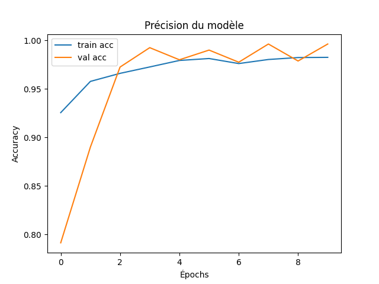

<div id="top"></div>

<br />

<p align="center">
  <strong><font size="6">Face Mask Detector</font></strong>
</p>

<p align="center">
  
</p>

<p align="center">
  
</p>

---

## ⚙️ Installation

### 1. Créer un environnement virtuel (recommandé)
```bash
python -m venv venv
```
### 2. Activer l'environnement virtuel
Windows :

```bash
venv\Scripts\activate
```

macOS / Linux :

```bash
venv/bin/activate
```
### 3. Installer les dépendances

```bash
pip install -r requirements.txt
```
### 4. Entraîner le modèle

```bash
python train.py
```

### 5. Tester le modèle avec Gradio
Une fois le modèle entraîné, lancez l’interface Gradio :

```bash
python gradioInterface.py
```